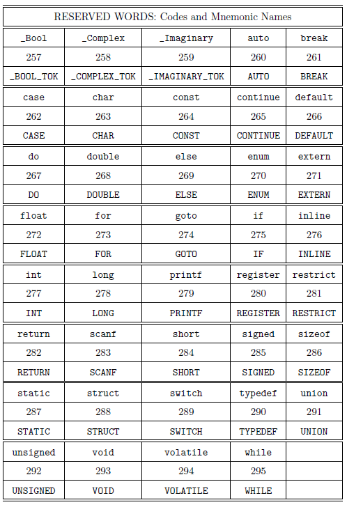
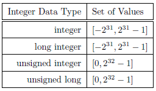
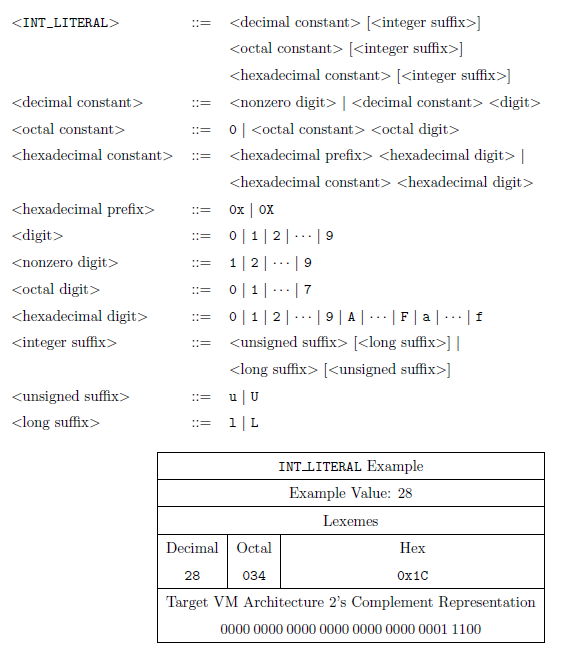
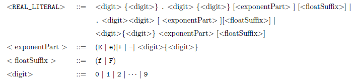
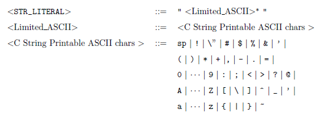
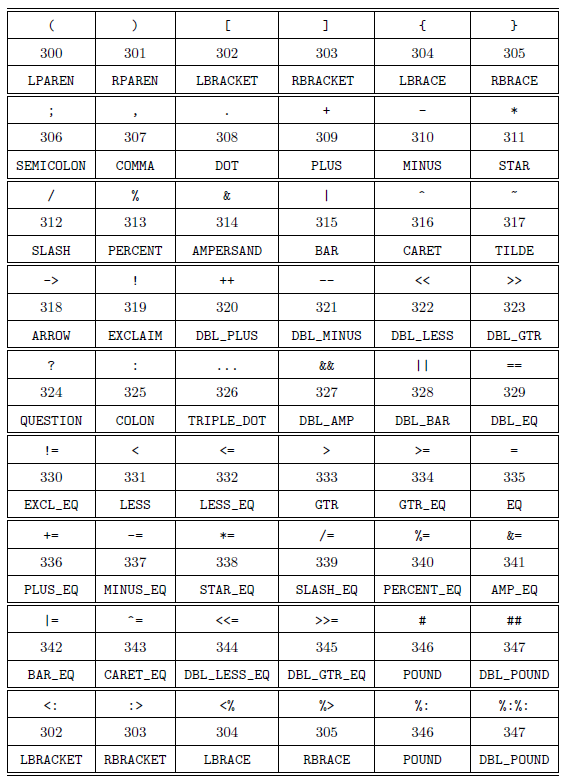

# C-Flat Translator Project

This README contains the specifications for a translator project that translates a subset of C into code to
be interpreted by a virtual machine. To be precise, C-flat is a not a true subset of C in that the identifiers, printf and scanf are considered reserved words in C-flat and are not reserved words in C; they will have similar semantics as the C corresponding library functions provided in C implementations. The syntax analysis of the translator is constructed with software tools, flex and yacc, that construct a scanner and parser, respectively, each written in C for the C-flat translator.


## Files Used and Descriptions

### Input File

(a) **Source File**: A textle containing a program written in C-flat source code. A user of C-flat supplies
the name of this file on a command-line. Thefile should have an extension of ".cf". The C-flat translator has the responsibility of opening, scanning, parsing, and closing this file.

### Output File

(a) Standard Output: The main test driver of scanner prints the tokens (string version of internal compiler name and lexeme for identifiers, string literals, and numeric (all type) literals.

(b) Source Listing: Thisfile is always produced and overwritten if it already exists. The contents
are a copy of the source file except with line numbers in starting in column 1. This file indicates where any errors occurs.

## Token and Lexeme Specifications

In C-flat there are six categories of tokens:

1. Reserved Words
2. Identiers
3. Integer Literals (int, unsigned, long, unsigned long expressed with decimal, octal, and hexadecimal digits)
4. Real Literals (float and double literals)
5. String Literals
6. Separators and Operators

For each token category, the codes and the lexeme syntax is given in the following subsections. Each reserved word is considered to be one token; so, there is one unique lexeme for each reserved word. Several different lexemes comprise the Identifier tokens.

### Reserved Identifiers

Each reserved word is represented by the lexeme, which is a legal identifier (which are denoted next), a unique numeric code and a unique MNEMONIC NAME to be used internally in the compiler. These are listed in alphabetical order in a table where each cell consists of a three vertical subcells that represent: the reserved word lexeme, the code that must be used, and the mnemonic name that must be used.



### Identifiers

Identifiers are represented by code 296 internal translator mnemonic name of IDENTIFIER. The legal identifier
lexemes are denoted by the following context free grammar expressed in EBNF.

\<IDENTIFIER\> ::= \<letter\> (\<letter\> | \<decimal digit\>)*  
\<letter\> ::= A | ... | Z | a | ... | z | _  
\<decimal digit\> ::= 0 | ... | 9  

### Integer Literals

Each Integer literal must be given the numeric code of 297 and the mnemonic name INT_LITERAL.
Each INT_LITERAL lexeme represents a denotation of a value that belongs to a set of values associated with an integer data type. C-flat has four integer data types: integer, long integer, unsigned integer, and unsigned long integer. The actual sets of values associated with each of these data types varies with the corresponding environment. For the VM platform of this project, the set of values for each these types is shown below. (The notation, [a, b], represents the closed interval of integer values.)



As with C, C-flat uses the reserved word, int, for the name of the integer data type. In combination with int or without int, the reserved words, long and unsigned, are used to name the long integer and unsigned integer data types, respectively. In C-flat, each non-negative integer value has three lexeme representations based upon decimal, octal, and hexadecimal bases. The negative values for integer and long integer data types are represented by using the unary minus operator, -, which is another token denoted later in this specification. Thus, there is no negative (or positive) sign as part of any integer lexeme; in this sense, there are no lexemes for negative values for integer and long integer data types.

A grammar for the language of INT_LITERALs is shown below.



### Real Literals: float and double literals

A grammar for the language of REAL_LITERALs are shown below. This token type has two lexeme patterns: for float and double. The only difference between these two is the f or F suffix for float lexemes.



### String Literals

String literals must have code 299 and mnemonic name of STR_LITERAL.



### Separator and Operator Literals

The codes for the separator and operator literals must correspond according to associations shown in the
following table.



### Comments

<COMMENT> ::= // <ASCII_WithoutNewLine>* newlinecharacter

## Scanner Design and Implementation Framework

### yacc input (.y)file format

The scanner must return the appropriate token code when recognizing a lexeme in that corresponding token category. As discussed above in the specification section, token code number must be given a mnemonic name. To associate these names with codes a .y file is used, which will be the input for yacc.

There are three sections (delimited by %% characters) in each .yfile:

```
declarations:
internal meta-level definitions for production rules
verbatim C/C++ code between %{ %} delimiters which is copied to y.tab.c and y.tab.h files.
%%
production rules for a LALR(1) grammar
%%
utility and supporting functions
```

### flex input .lle format

All of the regular expressions for the lexeme patterns are put into a .l file. The file name, cfScanner.l, is used.
Like .yles, the .l les has three sections (delimited by %% characters):

```
declarations:
internal meta-level definitions for production rules
verbatim C/C++ code between %{ %} delimiters files.
Inside the verbatim code, #include the y.tab.h file, which should have been
generated by yacc with option -d.
%%
(regEx action) where action is C/C++ code
executed when regEx is flex regular expressing a set of patterns.
%%
utility and supporting functions
```

The scanner generator, flex creates a lex.yy.cle from the contents of a .l le. This lex.yy.c is compiled.

## Implementation for Testing Scanner

The scanner test should include reading several C-flat source code files. The output of the scanner test should print, per line, the Token Mnemonic name and the corresponding lexeme (as a string or integer). The tester code simulates a very simple parser. It simply keeps calling yylex() until it returns 0, indicating the end of source file. This code corresponds to a EOF_TOKEN, which is not explicitly used in this project.
The general framework of the testing (driver) code should look like the following:

```
... // process arguments and open files
while( token = yylex() ) {
  if( token == IDENTIFIER ) {
    print the mnemonic string "IDENTIFIER" and the lexeme yylval.ident_name
  }
  else if (token == STR_LITERAL ) {
    print the mnemonic string "STR_LITERAL" and the lexeme yylval.string_value);
  }
  else if (token == INT_LITERAL ){
    print "INT_LITERAL" ;
    figure out what kind of INT_LITERAL (int, long, unsigned, unsigned long) and print the integer value appropriately
  } else if (token == REAL_LITERAL ){
    print "REAL_LITERAL" ;
    figure out what kind of REAL_LITERAL (float, double) and print the float value or print double value (%g) appropriately
  else
    print the token (e.g. reserved word, operator) mnemonic name and lexeme.
  }
}
close file(s)
```

## Examples
**Example 1:**
A sample C-flat source code in a file, sample.cf, is shown below.

```
#define PRIME 211
#define EOS 0
int hash(char *s)
{
  char *p;
  unsigned h = 0, g;
  for( p = s; *p != EOS; p++; ){
    h = (h << 4) + *p;
    if( g = h&0xf0000000u ){
      h = h^(g >> 24);
      h = h ^ g;
    }
  }
  return h % PRIME;
}
```
The listingle. sample.txt, should look like:

```
1 #define PRIME 211
2 #define EOS 0
3 //sample hash function
4 int hash(char *s)
5 {
6   char *p;
7   unsigned h = 0, g;
8   for( p = s; *p != EOS; p++; ){
9     h = (h << 4) + *p;
10    if( g = h&0xf0000000u ){
11      h = h^(g >> 24);
12      h = h ^ g;
13    }
14  }
15  return h % PRIME;
16 }
```

The standard output for the above source code example is shown below. Note that the comment is ignored. The standard output for running (testing) the scanner is shown below:

```
C> ...>cfScanner sample.cf
POUND #
IDENTIFIER define
IDENTIFIER PRIME
INT_LITERAL 211 211
POUND #
IDENTIFIER define
IDENTIFIER EOS
INT_LITERAL 0 0
INT int
IDENTIFIER hash
LPAREN (
CHAR char
STAR *
IDENTIFIER s
RPAREN )
LBRACE {
CHAR char
STAR *
IDENTIFIER p
SEMICOLON ;
UNSIGNED unsigned
IDENTIFIER h
EQ =
INT_LITERAL 0 0
COMMA ,
IDENTIFIER g
SEMICOLON ;
FOR for
LPAREN (
IDENTIFIER p
EQ =
IDENTIFIER s
SEMICOLON ;
STAR *
IDENTIFIER p
EXCL_EQ !=
IDENTIFIER EOS
SEMICOLON ;
IDENTIFIER p
DBL_PLUS ++
SEMICOLON ;
RPAREN )
LBRACE {
IDENTIFIER h
EQ =
LPAREN (
IDENTIFIER h
DBL_LESS <<
INT_LITERAL 4 4
RPAREN )
PLUS +
STAR *
IDENTIFIER p
SEMICOLON ;
IF if
LPAREN (
IDENTIFIER g
EQ =
IDENTIFIER h
AMPERSAND &
INT_LITERAL 0xf0000000u 4026531840
RPAREN )
LBRACE {
IDENTIFIER h
EQ =
IDENTIFIER h
CARET ^
LPAREN (
IDENTIFIER g
DBL_GTR >>
INT_LITERAL 24 24
RPAREN )
SEMICOLON ;
IDENTIFIER h
EQ =
IDENTIFIER h
CARET ^
IDENTIFIER g
SEMICOLON ;
RBRACE }
RBRACE }
RETURN return
IDENTIFIER h
PERCENT %
IDENTIFIER PRIME
SEMICOLON ;
RBRACE }
```
